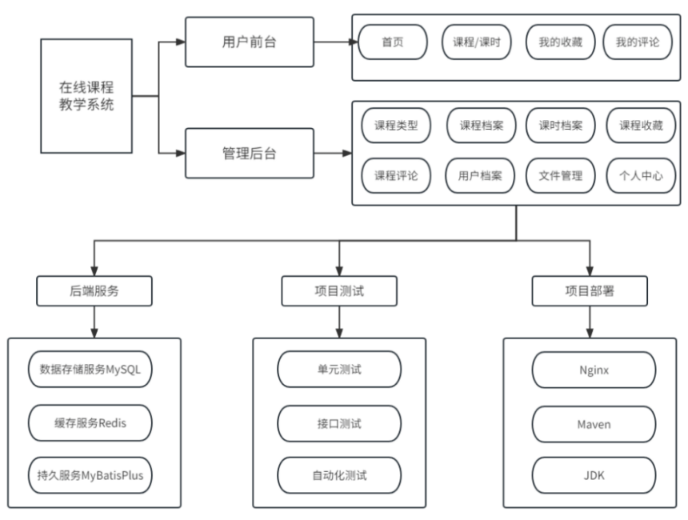

# Vue + SpringBoot3 开发在线课程教学系统

在当今快速发展的信息技术行业中，在线教育已经成为了一种越来越受欢迎的学习方式。随着互联网技术的不断进步和普及，越来越多的人选择通过网络平台获取知识和技能。在线课程教学系统作为一种新兴的教育模式，为学习者提供了更加便捷、灵活和个性化的学习体验。

## 项目简介

基于Vue+SpringBoot+MySQL的**在线课程教学系统**，包含了**课程类型模块、课程档案模块、课时档案模块、课时收藏模块、课时评论模块
**
，还包含系统自带的用户管理、部门管理、角色管理、菜单管理、日志管理、数据字典管理、文件管理、图表展示等基础模块，在线课程教学系统基于角色的访问控制，给学生、教师、高校管理员使用，可将权限精确到按钮级别，您可以自定义角色并分配权限，系统适合设计精确的权限约束需求。

## 项目价值

基于 Vue 和 SpringBoot 的在线课程教学系统是一种结合了前端框架 Vue.js 和 后端框架 SpringBoot 的在线教育解决方案。Vue.js
是一个轻量级的 JavaScript 框架，具有易学和使用的特点，可以快速构建出友好的界面，而 SpringBoot 则是一个基于 Spring
框架的快速开发平台，可以帮助开发者快速搭建和运行应用程序。

## 项目特色

采用 Vue + SpringBoot 标准前后端分离技术架构，对标当下流行项目开发架构。

项目包含基于 Vue3 的用户网页和 基于 Vue2 的后台管理系统，前端知识点涵盖全面。

项目使用基于 bettl 的代码生成器，前后端增删改查代码 10 秒生成，能够大大提高开发效率，只需要 2 小时即可完成一套毕业设计项目。

项目采用最新的 Element UI Plus 和 View UI 开发用户页面 + 管理后台，涵盖 Vue Roster 路由、Vuex 键值对存储、组件库等知识点。

Vue + SpringBoot + MySQL + Redis，Java 商业项目全栈开发实践，帮助开发者增长项目经验，对于提升你的市场竞争力有一定帮助。

系统界面美观，使用方便，开发教程详细完整。

## 功能架构

## 技术架构

